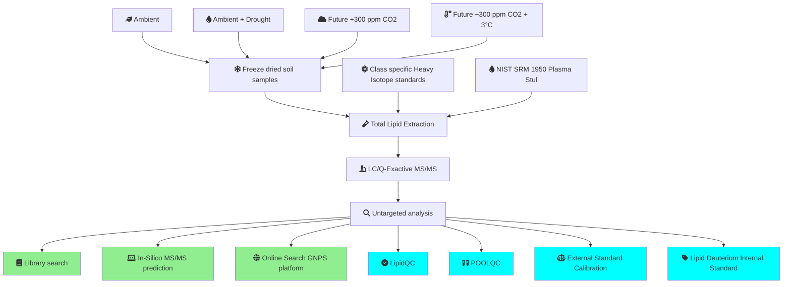

# Interactive Workflow Diagram with Icons

The following diagram represents the workflow for soil sample analysis. Click on any box to view more detailed information about that process.

## Workflow Description

1. The process begins with four different soil sample conditions:
   - [🍃 Ambient](ambient.md)
   - [💧 Ambient + Drought](ambient-drought.md)
   - [☁️ Future +300 ppm CO2](future-co2.md)
   - [🌡️ Future +300 ppm CO2 + 3°C](future-co2-temp.md)

2. These samples are [❄️ freeze-dried](freeze-dried-samples.md) for analysis.

3. [🧪 Total Lipid Extraction](lipid-extraction.md) is performed on the freeze-dried samples, incorporating [⚛️ Class specific Heavy Isotope standards](isotope-standards.md) and [💉 NIST SRM 1950 Plasma (Stul)](nist-srm-1950.md).

4. The extracted samples undergo [🔬 LC/Q-Exactive MS/MS analysis](lc-ms-ms.md).

5. [🔍 Untargeted analysis](untargeted-analysis.md) is performed on the MS/MS data.

6. The untargeted analysis results are then processed through several pathways:
   - [📚 Library search](library-search.md)
   - [💻 In-Silico MS/MS prediction](in-silico-prediction.md)
   - [🌐 Online Search GNPS platform](gnps-search.md)
   - Quality control measures: [✅ LipidQC](lipid-qc.md), [🧪 POOLQC](pool-qc.md)
   - Calibration: [⚖️ External Standard Calibration](external-calibration.md), [🏷️ Lipid Deuterium Internal Standard](internal-standard.md)

Note: In the diagram, green boxes represent search and prediction processes, while blue boxes represent quality control and calibration processes. Click on any box in the diagram or any link in this description to view more detailed information about that specific process.
