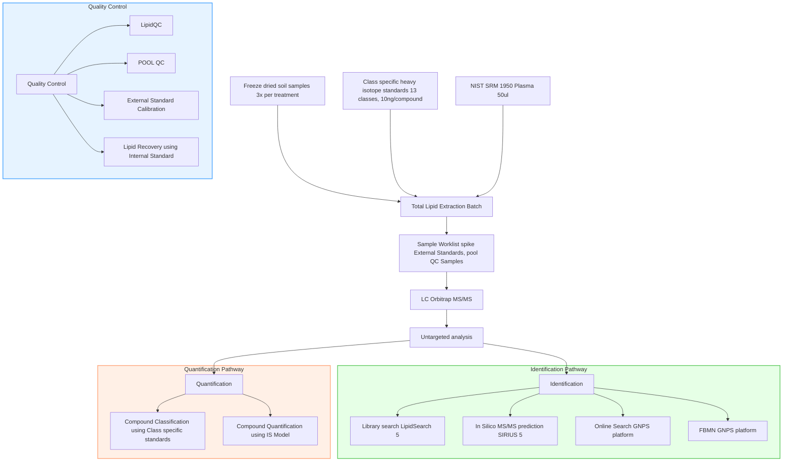

# Soil Sample Analysis Workflow

This README describes the workflow for analyzing freeze-dried soil samples using a combination of chemical extraction, chromatography, and computational analysis techniques.

## Workflow Diagram

The following diagram represents the workflow used for Lipidomics analysis in ClimGrass Experiment. Click on any box to view more detailed information about that process.

## Workflow Overview

1. Sample Preparation
2. Lipid Extraction
3. Chromatographic Analysis
4. Data Processing
5. Quality Control
6. Compound Identification and Quantification

## Results
Here you can find the codes, generated figures, and datafile used for figures in the respective folder

### Main Figures
- Fig1.[Lipid annotation using Library search and Prediction based approach](Results/Figure1/Figure1.ipynb)
- Fig2.[PCA and Interaction plot](Results/Figure2/Figure2.ipynb)
- Fig3.[FDR Hiararchical clustering Heatmap](Results/Figure3/Figure3.ipynb)
- Fig4.[Lipid Specificity & Shannon entropy](Results/Figure4/Figure4.ipynb)
- Fig5.[Class specific lipid concentration across treatment](Results/Figure5/figure5.ipynb)

### Supplementary files
- [Info](supplementary/Table-S1.docx)

### Supplementary Figures

1. Standards
S1. [Calibration curve Standards](Results/Calibration-curves/Calibration-curve.ipynb)
S2. [MS/MS spectra Standards](Results/Validation-of-current-lipidomics-workflow/LipidStandards/mass-spec-standards.ipynb)
S3. [Table Lipid Standard LOQ/LOQ](supplementary/calibration_table.pdf)
2. [Quality control POOL QC](supplementary/QC_percentage_differences_plot_with_threshold_neg.pdf)
S4. [QC figure Classwise]
3. External QC NIST SRM
S4. [NIST SRM 1950 LipidQC](supplementary/Soil_lipidomcis_NISTSRM1950.png)
4. Lipid Recovery
S5. [Recovery percentage internal standards]

## Detailed Steps

### 1. Sample Preparation

- Freeze-dried soil samples (3x per treatment)
- Class-specific heavy isotope standards (13 classes, 10ng/compound)
- NIST SRM 1950 Plasma (50ul) as a reference

### 2. Lipid Extraction

- Total Lipid Extraction Batch
- Sample Worklist (spike External Standards, pool QC Samples)

### 3. Chromatographic & High-resolution MS/MS analysis

- LC Orbitrap MS/MS
  - [LC parameters](methods/LC-parameters.pdf)
  - [Orbitrap parameters](methods/Orbitrap-parameters.pdf)
- Untargeted analysis

### 4. Data Processing

- Identification
- Quantification
  
### 5. Quality Control

Multiple QC steps are implemented throughout the workflow:

- **NIST SRM Inter Laboratory Comparison**
  - [Positive Ionization Mode Table](supplementary/Soil_lipidomics_SRM1950.pdf)
  - [Positive Ionization Mode Plot](supplementary/Soil_lipidomcis_NISTSRM1950.png)
  - [Negative Ionization Mode Table]()
  - [Negative Ionization Mode Plot]()
- **POOL QC**
  - [Analysis of variance across POOL sample runs (Positive mode)](supplementary/QC_percentage_differences_plot_with_threshold_neg.pdf)
- **External Standard Calibration**
  - 
- **Lipid Recovery using Internal Standard**

### 6. Compound Identification and Quantification

#### Identification:
- Library search (LipidSearch 5)
- In Silico MS/MS prediction SIRIUS 5
- Online Search GNPS platform
- FBMN GNPS platform

#### Quantification:
- Compound Classification using Class-specific standards
- Compound Quantification using Ionization efficiency Model

## Tools and Technologies

- LC-MS/MS: Orbitrap
- Software: LipidSearch 5, SIRIUS 5, GNPS platform

## Notes

- This workflow integrates both wet-lab techniques and computational analysis.
- Quality control measures are implemented at multiple stages to ensure data reliability.
- The process allows for both targeted and untargeted analysis of lipids in soil samples.

For more detailed information on each step, please refer to the specific folder readmd file.
