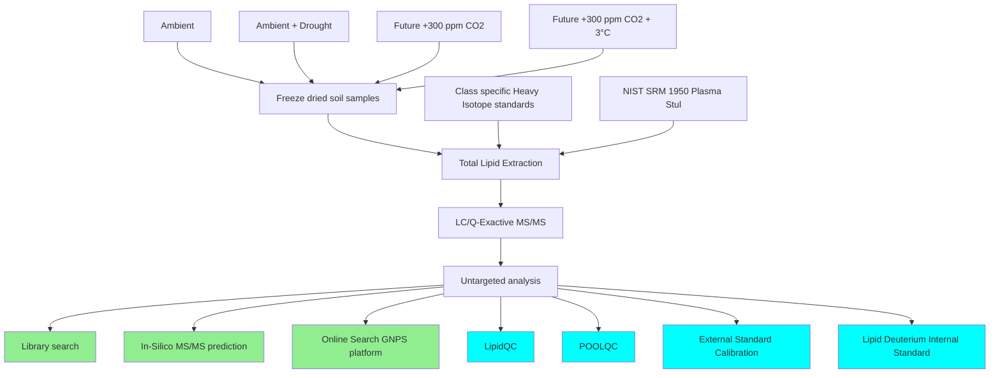

# Workflow Diagram

The following diagram represents the workflow for soil sample analysis:

## Workflow Description

1. The process begins with four different soil sample conditions: Ambient, Ambient + Drought, Future +300 ppm CO2, and Future +300 ppm CO2 + 3°C.

2. These samples are freeze-dried for analysis.

3. Total Lipid Extraction is performed on the freeze-dried samples, incorporating Class specific Heavy Isotope standards and NIST SRM 1950 Plasma (Stul).

4. The extracted samples undergo LC/Q-Exactive MS/MS analysis.

5. Untargeted analysis is performed on the MS/MS data.

6. The untargeted analysis results are then processed through several pathways:
   - Library search
   - In-Silico MS/MS prediction
   - Online Search GNPS platform
   - Quality control measures: LipidQC, POOLQC
   - Calibration: External Standard Calibration, Lipid Deuterium Internal Standard

Note: In the diagram, green boxes represent search and prediction processes, while blue boxes represent quality control and calibration processes.

