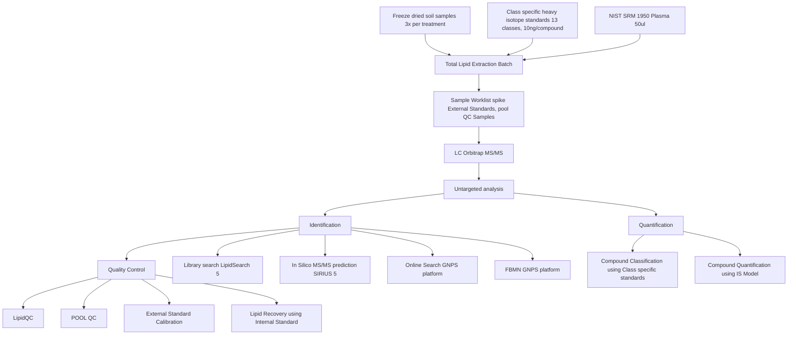

# Soil Sample Analysis Workflow

This README describes the workflow for analyzing freeze-dried soil samples using a combination of chemical extraction, chromatography, and computational analysis techniques.

## Workflow Diagram

## Workflow Overview

1. Sample Preparation
2. Lipid Extraction
3. Chromatographic Analysis
4. Data Processing
5. Quality Control
6. Compound Identification and Quantification

## Detailed Steps

### 1. Sample Preparation

- Freeze-dried soil samples (3x per treatment)
- Class-specific heavy isotope standards (13 classes, 10ng/compound)
- NIST SRM 1950 Plasma (50ul) as a reference

### 2. Lipid Extraction

- Total Lipid Extraction Batch
- Sample Worklist (spike External Standards, pool QC Samples)

### 3. Chromatographic Analysis

- LC Orbitrap MS/MS
- Untargeted analysis

### 4. Data Processing

- Identification
- Quantification

### 5. Quality Control

Multiple QC steps are implemented throughout the workflow:

- LipidQC
- POOL QC
- External Standard Calibration
- Lipid Recovery using Internal Standard

### 6. Compound Identification and Quantification

#### Identification Pathway:
- Library search (LipidSearch 5)
- In Silico MS/MS prediction SIRIUS 5
- Online Search GNPS platform
- FBMN GNPS platform

#### Quantification Pathway:
- Relative quantification using Class-specific lipid standards
- Relative Quantification using Ionization efficiency Model

## Tools and Technologies

- LC-MS/MS: Orbitrap
- Software: LipidSearch 5, SIRIUS 5, GNPS platform

## Notes

- This workflow integrates both wet-lab techniques and computational analysis.
- Quality control measures are implemented at multiple stages to ensure data reliability.
- The process allows for both targeted and untargeted analysis of lipids in soil samples.

For more detailed information on each step, please refer to the specific protocols and standard operating procedures.
